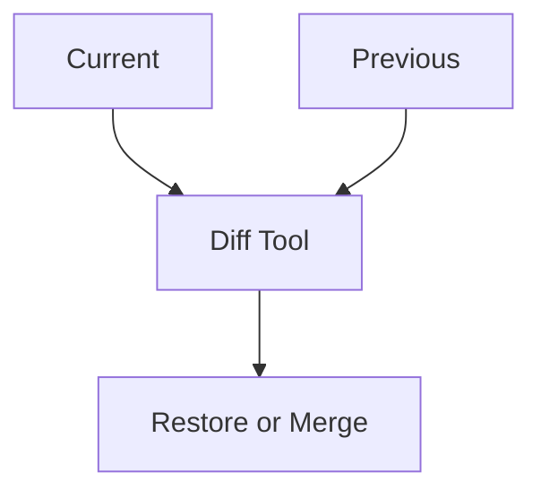

## Overview

Вячеслав Стёпин provides powerful tools to create, edit, organize, and version your documentation efficiently. You streamline your workflow with intuitive page creation, rich formatting options, smart search, and basic version control. These features help you build professional docs sites without complexity.

<Columns cols={2}>
  <Card title="Intuitive Editing" icon="edit-3" href="#content-editing">
    Format content using markdown, MDX components, and live previews.
  </Card>
  <Card title="Smart Organization" icon="folder" href="#search-organization">
    Tag, categorize, and search docs effortlessly.
  </Card>
</Columns>

## Page Creation and Structuring

Create new pages quickly and structure them with hierarchical headings and components. Start by navigating to the docs root and selecting "New Page". Name your file like `features.mdx` for MDX support.

<Steps>
  <Step title="Create Page" icon="plus">
    Click the "+" button in your docs sidebar.

    Choose "MDX Page" for component support.
  </Step>
  <Step title="Add Frontmatter" icon="file-text">
````yaml
---
title: Your Page Title
description: Brief page summary
---
````

    Always include YAML frontmatter at the top.
  </Step>
  <Step title="Structure Content" icon="layout">
    Use H2 (##) for main sections and nest H3 (###) subsections.

    Add components like `<Callout>` for emphasis.
  </Step>
</Steps>

<Callout kind="tip">
  Use PascalCase for components like `<Card title="Example" />` and escape special characters such as `{variable}` with backticks in prose.
</Callout>

## Content Editing and Formatting Tools

Edit content with markdown syntax, enhanced by MDX components for interactive elements. Preview changes live to ensure perfect rendering.

<Tabs>
  <Tab title="Markdown Basics" icon="code">
    Write standard markdown:

````markdown
## Heading

- List item
- Another item

`Inline code` for variables.
````
  </Tab>
  <Tab title="MDX Components" icon="components">
    Embed interactive elements:

````jsx
<Columns cols={2}>
  <Card title="Feature 1" icon="star" />
  <Card title="Feature 2" icon="heart" />
</Columns>
````
  </Tab>
  <Tab title="Code Examples" icon="bracket">
    Use fenced blocks:

````javascript
const apiKey = 'YOUR_API_KEY';
fetch('https://api.example.com/docs', {
  headers: { Authorization: `Bearer ${apiKey}` }
});
````
  </Tab>
</Tabs>

## Search and Organization Features

Organize docs with tags, folders, and full-text search. Quickly find pages by keyword or filter by labels.

| Feature | Description | Example Use |
|---------|-------------|-------------|
| Full-Text Search | Searches titles, content, and tags | Type "version control" to find related pages |
| Tags | Add labels like `guide`, `api` | Filter sidebar by `["feature", "guide"]` |
| Folders | Nest pages hierarchically | `/guides/features.mdx` |
| Quick Nav | Breadcrumbs and sidebar links | Jump between `/introduction` and `/features` |

<Callout kind="info">
  Assign tags during page creation to enable advanced filtering. Use `{["guide", "core"]}` format in frontmatter if supported.
</Callout>

## Version Control Basics

Track changes with built-in version history. View diffs, revert edits, and collaborate safely.

<ExpandableGroup>
  <Expandable title="View History" default-open="true">
    Right-click a page and select "History".

    See commit-like snapshots with timestamps and authors.
  </Expandable>
  <Expandable title="Revert Changes">
    Select a previous version and click "Restore".

    This creates a new version without overwriting current content.
  </Expandable>
  <Expandable title="Compare Versions">
    Use the diff view to spot changes:


  </Expandable>
</ExpandableGroup>

## Next Steps

Dive deeper into advanced features.

<Columns cols={3}>
  <Card title="Advanced Components" icon="layers" href="#advanced-components">
    Explore `<Steps>`, `<Tabs>`, and more.
  </Card>
  <Card title="API Integration" icon="zap" href="https://api.example.com/docs">
    Connect external services.
  </Card>
  <Card title="Customization" icon="settings">
    Theme and configure your docs site.
  </Card>
</Columns>